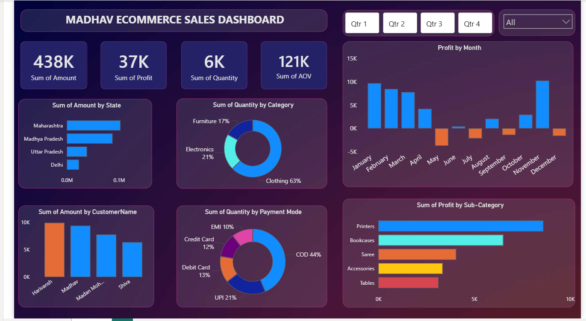
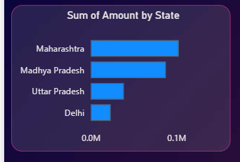
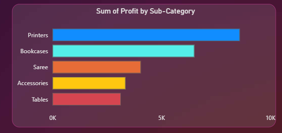
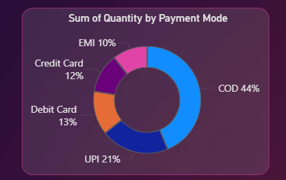

# 📊 Madhav Ecommerce Sales Dashboard (Power BI)

## About the Project

This project presents an interactive Power BI dashboard built to analyze ecommerce sales performance, profitability, customer purchasing patterns, and payment preferences.

The dashboard provides a comprehensive view of key business metrics and enables users to explore sales trends across states, customers, product categories, sub-categories, and payment methods.

---

## Project Objectives

- Analyze overall sales and profit performance
- Identify top-performing states and customers
- Evaluate category-wise sales distribution
- Track monthly profit trends
- Analyze payment mode preferences
- Monitor product sub-category profitability
- Create an interactive dashboard for business decision-making

---

## Dataset Information

The project uses ecommerce transaction data consisting of:

### Orders Table
- Order ID
- Order Date
- Customer Name
- State
- City

### Transaction Details Table
- Product Category
- Product Sub-Category
- Amount
- Profit
- Quantity
- Payment Mode

The data was modeled in Power BI to analyze sales performance, profitability, customer behavior, and payment preferences.
---

## Tools & Technologies

### Data Visualization
- Power BI

### Data Preparation
- Power Query

### Data Modeling
- DAX Measures
- Calculated Fields

---

## Dashboard Features

### KPI Metrics

- Total Sales Amount: 438K
- Total Profit: 37K
- Total Quantity Sold: 6K
- Average Order Value (AOV): 121K

### Sales Analysis

- Sales by State
- Sales by Customer
- Sales by Category

### Profit Analysis

- Monthly Profit Trends
- Profit by Product Sub-Category

### Customer Insights

- Top Customers
- Payment Mode Preferences

### Interactive Features

- Quarter-wise Filtering
- Category Filtering
- Dynamic Visual Exploration

---

## Key Insights

- Maharashtra generated the highest sales among all states.
- Clothing contributed the largest share of total sales quantity.
- Cash on Delivery (COD) was the most preferred payment mode.
- Printers and Bookcases generated the highest profits among sub-categories.
- Monthly profit fluctuated significantly throughout the year, with strong performance in November and December.
- A small group of customers contributed a significant portion of total sales.

---

## Repository Structure

📁 Dataset

📁 Power BI Dashboard

📁 Insights

📁 Screenshots

📄 README.md

---

## Sample Dashboard Outputs

### Dashboard Overview

This overview dashboard provides key business KPIs including Total Sales Amount, Total Profit, Total Quantity Sold, and Average Order Value (AOV), along with interactive filters for deeper analysis.

---

### State-wise Sales Analysis

This visualization highlights sales performance across different states, helping identify top-performing regions and market opportunities.

---

### Profit Analysis

This analysis identifies the most profitable product sub-categories, supporting profitability-focused decision making.

---

### Payment Mode Analysis

This visualization shows customer payment preferences and helps understand transaction behavior across different payment methods.

---

## Author

**Naman Tripathi**

B.Tech, Materials & Metallurgical Engineering

MANIT Bhopal
